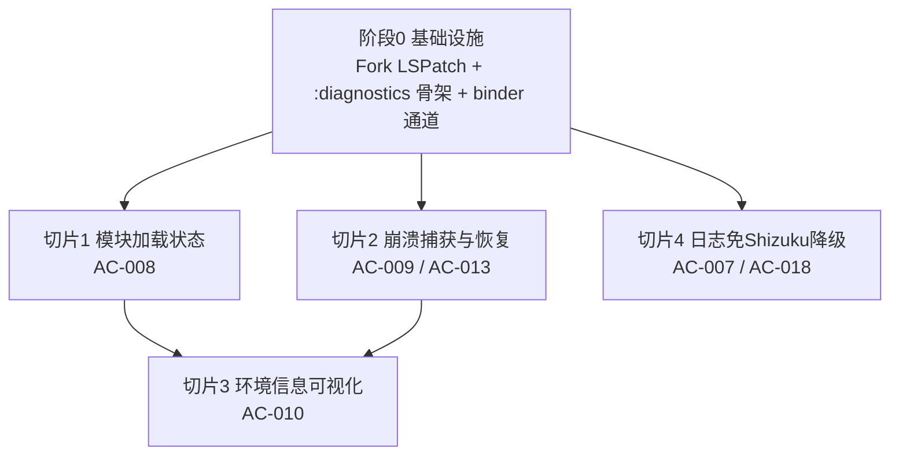

# 无 Root Xposed 模块运行框架 — 任务规划

## 1. 切片划分与依赖

- 阶段0 🔒（关键路径，所有切片依赖）
- 切片1 / 切片2 / 切片4 可并行（互不依赖）
- 切片3 依赖切片1（作用域视图读 ModuleLoadStatus）和切片2（展示崩溃历史）

## 2. 任务清单

### 阶段 0：基础设施

> 阶段完成标准：开发者 fork LSPatch 后能在本机构建出 manager.apk 与 lspatch.jar，诊断模块骨架就位，诊断 binder 通道可往返打通；同时确认 LSPatch 复用能力（重打包/调试/模块管理/错误处理）在本 fork 上正常工作。

#### T-001 Fork LSPatch 并构建通过
- **通俗解释**：把 LSPatch 的代码拉到自己仓库，在本机能编译出可安装的管理器应用和命令行打包工具，这是后续一切工作的起点。
- **依赖**：无
- **对应方案章节**：§1 / §2.1
- **对应 AC**：AC-021（版本范围）
- **验证标准**（RED 用例）：
  - 执行 `./gradlew :manager:assembleRelease` → 产出 `manager/build/outputs/apk/release/manager.apk`，文件非空
  - 执行 `./gradlew :jar:assembleRelease` → 产出 `jar/build/libs/lspatch.jar`，`java -jar lspatch.jar --help` 退出码 0 并打印 usage
  - 执行 `./gradlew spotlessCheck` → 退出码 0（代码风格符合上游）
  - 在 Android 9+ 设备安装 manager.apk → 启动不崩溃，显示首页

#### T-002 验证 LSPatch 复用能力基线
- **通俗解释**：在动手做诊断增强前，先确认 fork 出来的版本仍能正常完成"装模块→打补丁→运行模块"这条主线，以及各种出错场景的提示都在，避免后面发现基座坏了。
- **依赖**：T-001
- **对应方案章节**：§7 AC 覆盖矩阵（复用行）
- **对应 AC**：AC-001、AC-002、AC-003、AC-004、AC-005、AC-006、AC-011、AC-012、AC-014、AC-015、AC-016、AC-017、AC-019、AC-020
- **验证标准**（手动验收清单，每条对应一个 AC）：
  - AC-001：在 manager 安装一个有效 Xposed 模块 APK → 模块列表出现该模块且默认未启用
  - AC-002：切换某模块启用开关 → 状态更新，后续打补丁按状态生效
  - AC-003：选已装目标应用 + 勾选已启用模块，Integrated mode 重打包 → 安装产物后启动，模块生效
  - AC-004：用 `java -jar lspatch.jar patch app.apk` 对 APK 文件重打包 → 产出可安装补丁应用
  - AC-005：Manager mode 首次对目标应用打补丁 → 生成调试版应用，启动时从 manager 读已启用模块并加载
  - AC-006：调试版应用已装，改模块代码重装模块 APK 后重启目标应用 → 新模块生效，未重打补丁
  - AC-011：安装非 Xposed 模块普通 APK → 拒绝并提示"非有效 Xposed 模块"
  - AC-012：对加固/split APK 重打包 → 失败并给出具体原因，不产出半成品
  - AC-014：设备已装原版目标应用时安装补丁应用 → 检测签名冲突并引导卸载原版或克隆包名
  - AC-015：存储空间不足时重打包 → 给出"空间不足"提示
  - AC-016：对已打补丁应用再次重打包 → 识别已有补丁，提示更新/覆盖
  - AC-017：模块 Hook 目标应用不存在的类/方法 → 优雅降级记录警告，不崩溃
  - AC-019：卸载补丁应用 → 完全恢复原状，原 APK 未被修改
  - AC-020：分别加载传统 Xposed API 模块与 libxposed API 模块 → 两种均正常工作

#### T-003 新建 :diagnostics 模块骨架
- **通俗解释**：搭一个专门放诊断相关代码的新模块，定义好"模块加载状态""崩溃报告""环境信息"这些数据长什么样，后面所有诊断功能都往这里填。
- **依赖**：T-001
- **对应方案章节**：§2.1 / §3.1
- **对应 AC**：AC-008、AC-009、AC-010（数据模型基础）
- **验证标准**（RED 用例）：
  - `:diagnostics` 模块加入 `settings.gradle.kts` 的 include 列表 → `./gradlew :diagnostics:build` 成功
  - `ModuleLoadStatus` 可序列化（实现 Parcelable 或标注 @Serializable），字段 `modulePackage/hostPackage/hostProcess/status/errorMessage/errorStack/loadedAt` 齐全
  - `CrashReport` 字段 `id/hostPackage/hostProcess/timestamp/threadName/stackTrace/suspectedModule/loadedModules` 齐全
  - `EnvironmentInfo` 字段 `vectorVersion/vectorApiCode/lsplantVersion/androidVersion/abi/scopeView/patchedApps` 齐全，`ScopeEntry` 含 `modulePackage/targetPackage/enabled/loaded`
  - `LoadStatus` 枚举含 `LOADING/SUCCESS/FAILED` 三态

#### T-004 诊断 binder 通道打通
- **通俗解释**：在目标应用和管理器之间开一条专门传诊断数据的小路，让应用里发生的诊断信息能实时送回管理器展示，不依赖 Shizuku。
- **依赖**：T-003
- **对应方案章节**：§4.1 / §4.2
- **对应 AC**：AC-018（诊断免 Shizuku 的通道基础）
- **验证标准**（RED 用例）：
  - `IDiagnosticsChannel.aidl` 定义 `onModuleLoadStatus/onCrash/onLog` 三方法 → 编译产出对应 Stub/Proxy
  - patch-loader 端在绑定 `IFrameworkService` 后能取得 `IDiagnosticsChannel` 实例（非 null）
  - manager 端 `DiagnosticsService` 实现 `IDiagnosticsChannel.Stub`，收到任一方法调用能在日志中观察到入参
  - manager 未启动时，patch-loader 获取 `IDiagnosticsChannel` 返回 null 且不抛异常（降级到本地持久化，不阻塞宿主）

---

### 切片 1：模块加载状态（AC-008）

> 切片完成标准：开发者在管理器里点开任一已打补丁应用的详情，能看到该应用当前加载了哪些模块、每个模块是加载成功还是失败、失败的具体原因和堆栈。

#### T-005 加载状态探针与本地持久化
- **通俗解释**：在目标应用加载每个模块的关键时刻记录"开始加载/加载成功/加载失败"，失败时连原因和堆栈一起记下来，先存到应用自己的本地文件里防止丢失。
- **依赖**：T-004
- **对应方案章节**：§5.1 / §3.2
- **对应 AC**：AC-008
- **验证标准**（RED 用例）：
  - 正常模块加载完成后，`<host noBackupFilesDir>/lspatch-diagnostics/module_status.json` 含该模块条目，status=`SUCCESS`，loadedAt 为合法时间戳
  - 加载抛异常的模块，对应条目 status=`FAILED`，errorMessage 非空且包含异常 message，errorStack 含堆栈文本
  - 同一模块多次加载，文件中保留最新状态（覆写而非追加）
  - 探针插入不改变宿主正常启动流程（无探针时与有探针时启动行为一致，均到达 `LSPatch bootstrap completed`）

#### T-006 加载状态 binder 推送与 manager 接收
- **通俗解释**：把上一步记下的加载状态实时推送给管理器，管理器收到后存在内存里供页面展示。
- **依赖**：T-005
- **对应方案章节**：§4.1 / §5.1
- **对应 AC**：AC-008
- **验证标准**（RED 用例）：
  - 模块加载状态变化时，patch-loader 调用 `IDiagnosticsChannel.onModuleLoadStatus` 推送 → manager `DiagnosticsRepository` 内存态更新
  - manager 未连接时推送静默失败，不影响宿主；下次连接后通过回读 `module_status.json` 补齐（回读路径与推送数据一致）
  - 推送失败不抛异常到宿主业务流程

#### T-007 AppDetailScreen 加载状态展示
- **通俗解释**：在已打补丁应用的详情页加一块区域，列出该应用当前加载的模块和每个模块的加载结果，失败的直接显示原因，开发者不用再去翻日志。
- **依赖**：T-006
- **对应方案章节**：§5.1
- **对应 AC**：AC-008
- **验证标准**（RED 用例）：
  - 打开任一 patched 应用详情页 → 存在"模块加载状态"区域
  - 区域列出每个已加载模块及其状态（SUCCESS 绿/FAILED 红/LOADING 灰）
  - FAILED 模块点击展开 → 显示 errorMessage 与 errorStack
  - 数据来源为 `DiagnosticsRepository` 内存态，无数据时显示空态提示

---

### 切片 2：崩溃捕获与恢复（AC-009 / AC-013）

> 切片完成标准：目标应用因模块崩溃后，开发者在管理器能看到崩溃堆栈和被怀疑的模块；并能从崩溃报告直接跳转禁用致崩模块，重启后应用恢复正常。

#### T-008 崩溃 UncaughtExceptionHandler 与归属判定
- **通俗解释**：在目标应用最早期装一个崩溃监听器，一旦崩溃就把堆栈记下来，并自动判断这个崩溃八成是哪个模块搞的（看堆栈里类名属于哪个模块包）。
- **依赖**：T-004
- **对应方案章节**：§5.2
- **对应 AC**：AC-009
- **验证标准**（RED 用例）：
  - `LSPApplication.onLoad` 最早期注册 `Thread.setDefaultUncaughtExceptionHandler` → 注册成功且不破坏原默认 handler（链式调用 previous）
  - 模拟模块代码抛未捕获异常（堆栈含模块包名 `com.example.mymodule`）→ 生成的 CrashReport.suspectedModule=`com.example.mymodule`
  - 堆栈不含任何已加载模块包名 → suspectedModule=null
  - handler 执行完毕后仍触发系统默认崩溃流程（应用按预期崩溃，不被吞掉）

#### T-009 崩溃本地原子持久化
- **通俗解释**：把崩溃报告写到目标应用自己的本地文件里，用"先写临时文件再改名"的方式保证哪怕进程刚崩也能写完整，不会写出一半的坏文件。
- **依赖**：T-008
- **对应方案章节**：§3.2 / §5.2
- **对应 AC**：AC-009
- **验证标准**（RED 用例）：
  - 崩溃后 `<host noBackupFilesDir>/lspatch-diagnostics/crashes/<uuid>.json` 存在且为合法 JSON，字段齐全
  - `crash_index.json` 追加一条索引（id/hostPackage/timestamp/suspectedModule）
  - 写文件过程中模拟进程被杀（用临时文件 rename 前检查）→ 不存在半成品 `<uuid>.json`，只有完整文件或不存在
  - 写本地失败时静默，不抛二次异常

#### T-010 崩溃报告 best-effort 推送
- **通俗解释**：崩溃发生时顺便试着把报告实时发给管理器，发得了就发，发不了（进程要死了）也不强求，反正本地已经存了一份。
- **依赖**：T-009
- **对应方案章节**：§4.2
- **对应 AC**：AC-009
- **验证标准**（RED 用例）：
  - 崩溃时调用 `IDiagnosticsChannel.onCrash` → manager 收到并入库存 CrashReport（manager 活时）
  - manager 未连接/调用失败 → 静默，不影响本地持久化结果
  - 推送与本地写顺序：先写本地成功后再尝试推送（保证真相源）

#### T-011 manager 回读崩溃报告
- **通俗解释**：目标应用崩过之后，管理器下次能从应用的本地文件里把崩溃报告读出来，即使崩溃那会儿管理器没在跑也不丢。
- **依赖**：T-010
- **对应方案章节**：§4.2 / §5.2
- **对应 AC**：AC-009
- **验证标准**（RED 用例）：
  - patched 应用崩溃后重启，manager 通过 `LSPatchDocumentsProvider` 读到 `crashes/<uuid>.json` → 反序列化为 CrashReport
  - 读 `crash_index.json` → 得到崩溃列表
  - 无崩溃记录时回读返回空列表，不报错

#### T-012 CrashReportScreen 崩溃报告展示
- **通俗解释**：新增一个崩溃报告页面，开发者能看到每次崩溃的堆栈、时间、怀疑的模块，一目了然知道是不是模块惹的祸。
- **依赖**：T-011
- **对应方案章节**：§5.2 / §9
- **对应 AC**：AC-009
- **验证标准**（RED 用例）：
  - manager 新增 CrashReportScreen 路由 → 可从首页/应用详情进入
  - 列表展示各崩溃（时间/host 包名/suspectedModule），无 suspectedModule 标注"未关联模块"
  - 点击单条 → 展示完整 stackTrace、loadedModules 快照、suspectedModule
  - 无崩溃记录时显示空态

#### T-013 崩溃致崩模块禁用恢复
- **通俗解释**：在崩溃报告里如果定位到是某个模块导致的，开发者能直接从这里跳过去把那个模块关掉，重启应用就能恢复正常。
- **依赖**：T-012
- **对应方案章节**：§5.2 / §6
- **对应 AC**：AC-013
- **验证标准**（RED 用例）：
  - CrashReportScreen 中 suspectedModule 非空的崩溃 → 提供"禁用该模块"操作
  - 点击禁用 → 该模块在 modules_config.db 中 enabled 置 false
  - 重启 patched 应用 → 应用正常启动，该模块未加载，无崩溃

---

### 切片 3：环境信息可视化（AC-010）

> 切片完成标准：开发者在管理器能打开一个环境信息页，看到 Vector/LSPlant 框架版本、设备与 ABI、作用域生效视图（哪些模块配了作用于哪些应用、当前是否真加载了）、已打补丁应用列表。

#### T-014 环境信息数据聚合
- **通俗解释**：把分散在各处的框架版本、设备信息、模块作用域配置、实际加载状态这些数据收集到一起，供环境信息页使用。
- **依赖**：T-006（加载状态）、T-011（崩溃历史）、T-002（modules_config.db/Manage 数据）
- **对应方案章节**：§5.3 / §3.1
- **对应 AC**：AC-010
- **验证标准**（RED 用例）：
  - `EnvironmentInfo` 填充：vectorVersion/vectorApiCode 来自 LSPLogSource 现有版本常量且非空
  - androidVersion 来自 `Build.VERSION.RELEASE`，abi 来自 `Build.SUPPORTED_ABIS[0]`
  - scopeView 聚合：每个模块配置的目标应用 + enabled（配置层）+ loaded（来自 ModuleLoadStatus 当前态）
  - patchedApps 来自现有 Manage 数据

#### T-015 DiagnosticsScreen 环境信息页
- **通俗解释**：新增一个环境信息页面，把上一步收集的信息展示出来，开发者能直观看到当前框架版本、设备情况、作用域配置和实际加载的差异。
- **依赖**：T-014
- **对应方案章节**：§5.3 / §9
- **对应 AC**：AC-010
- **验证标准**（RED 用例）：
  - manager 新增 DiagnosticsScreen 路由 → 可从首页进入
  - 展示框架版本/API/LSPlant 版本/Android 版本/ABI 区块
  - 作用域生效视图区块：列表项显示 modulePackage/targetPackage/enabled/loaded，enabled≠loaded 时有视觉区分（如"已配置未加载"标黄）
  - 展示 patched 应用列表区块
  - 数据缺失时各区块显示空态，不崩溃

---

### 切片 4：日志免 Shizuku 降级（AC-007 / AC-018）

> 切片完成标准：在没有 Shizuku 的设备上，开发者仍能在管理器看到模块的关键日志（WARN/ERROR + 模块 tag），不必为诊断功能专门激活 Shizuku。

#### T-016 日志 binder 降级源推送与接收
- **通俗解释**：让目标应用在写日志的同时，把关键的警告和错误日志通过诊断通道实时发给管理器，这样没有 Shizuku 也能看到重要日志。
- **依赖**：T-004
- **对应方案章节**：§5.4
- **对应 AC**：AC-007、AC-018
- **验证标准**（RED 用例）：
  - patch-loader 端 `XLog`/`XposedBridge.log` 写 WARN/ERROR 或模块 tag 时 → 调用 `IDiagnosticsChannel.onLog` 推送 LogEntry
  - manager 收到 LogEntry → 存入降级日志缓冲（与 Shizuku logcat 流隔离）
  - 推送失败静默，不影响宿主日志写入 logcat

#### T-017 LogsScreen 降级源切换
- **通俗解释**：在日志页面加个切换，开发者能选择看 Shizuku 采集的完整日志，还是看诊断通道送来的关键日志，没装 Shizuku 也能用前者之外的那条。
- **依赖**：T-016
- **对应方案章节**：§5.4
- **对应 AC**：AC-007、AC-018
- **验证标准**（RED 用例）：
  - LogsScreen 增加数据源切换（Shizuku 日志 / 诊断降级源）
  - 无 Shizuku 时切换到降级源 → 能展示模块 WARN/ERROR 日志，不报错
  - 有 Shizuku 时默认 Shizuku 源，切换降级源仍可用
  - 端到端：未授权 Shizuku 的设备上，完成"装模块→打补丁→看日志→看加载状态→看崩溃"全流程不触发 Shizuku 授权弹窗 → AC-018

---

## 3. AC 覆盖追溯

| AC | 任务 |
|---|---|
| AC-001 | T-002 |
| AC-002 | T-002 |
| AC-003 | T-002 |
| AC-004 | T-002 |
| AC-005 | T-002 |
| AC-006 | T-002 |
| AC-007 | T-016、T-017 |
| AC-008 | T-005、T-006、T-007 |
| AC-009 | T-008、T-009、T-010、T-011、T-012 |
| AC-010 | T-014、T-015 |
| AC-011 | T-002 |
| AC-012 | T-002 |
| AC-013 | T-013 |
| AC-014 | T-002 |
| AC-015 | T-002 |
| AC-016 | T-002 |
| AC-017 | T-002 |
| AC-018 | T-004、T-016、T-017 |
| AC-019 | T-002 |
| AC-020 | T-002 |
| AC-021 | T-001 |

21 条 AC 全覆盖，无遗漏。

## 4. 验证计划

| 检查项 | 关联任务 | 关联 AC |
|---|---|---|
| Fork 产物可构建（manager.apk + lspatch.jar） | T-001 | AC-021 |
| LSPatch 主线能力回归（装/打补丁/调试/错误提示） | T-002 | AC-001~006,011,012,014~017,019,020 |
| 诊断 binder 通道往返打通，manager 未起时降级 | T-004 | AC-018 |
| 模块加载状态结构化记录并展示 | T-005~T-007 | AC-008 |
| 崩溃主动捕获+归属判定+持久化+回读+展示+禁用恢复 | T-008~T-013 | AC-009,AC-013 |
| 环境信息页与作用域生效视图 | T-014~T-015 | AC-010 |
| 无 Shizuku 下日志降级源可用 | T-016~T-017 | AC-007,AC-018 |
| 端到端：未授权 Shizuku 完成全诊断流程 | T-017 | AC-018 |

## 5. 执行建议

- **关键路径**：T-001 → T-003 → T-004，必须先完成，锁定后续所有切片。
- **并行机会**：T-005~T-007（切片1）、T-008~T-013（切片2）、T-016~T-017（切片4）三组无相互依赖，可并行推进。
- **串行收口**：T-014~T-015（切片3）等切片1、切片2 就绪后启动。
- ⚠️ **风险点**：T-008 崩溃 handler 注册时机与 native patch_loader 的协作需实测，注册过晚可能漏捕早期崩溃；T-009 原子写在极端杀进程场景需压测。
