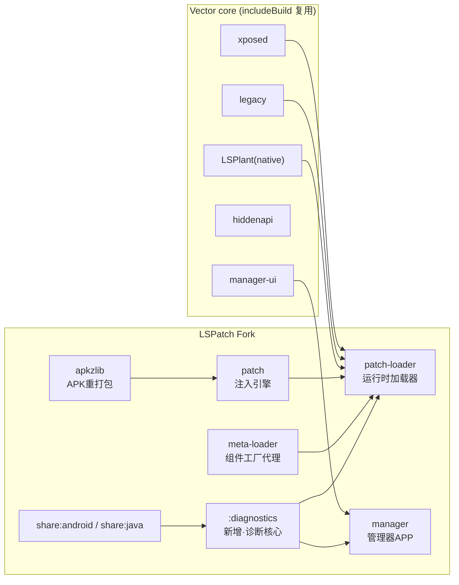
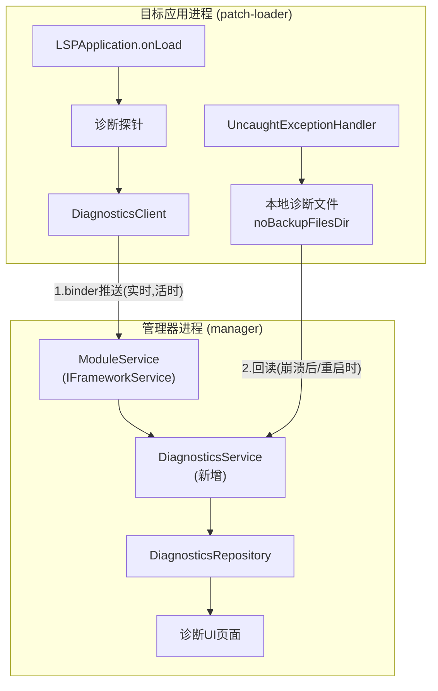
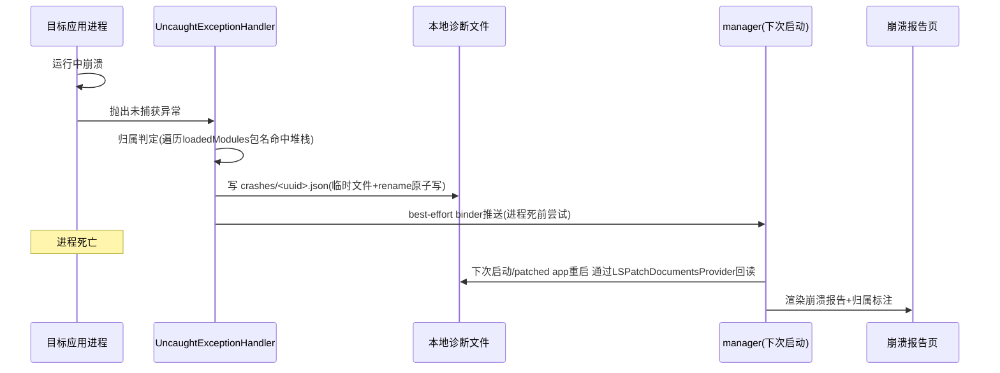

# 无 Root Xposed 模块运行框架 — 技术方案

## 1. 概述与定位

以 **LSPatch**（`JingMatrix/LSPatch`，Vector 的官方无 root 伴生项目）为基座 fork，复用其成熟的 LSPlant hook 集成、APK 重打包引擎、Manager/Integrated 双模式与 manager UI；本项目的增量价值聚焦在**面向开发者的诊断增强**——结构化模块加载状态、主动崩溃捕获与归属判定、环境信息可视化与作用域生效视图，并使核心诊断能力**免 Shizuku 降级**可用，保证 AC-018 完整流程免 root。

> 技术栈基线：继承 LSPatch 现有技术栈（Kotlin + Jetpack Compose + Material3 Expressive + Navigation3 + AGP + NDK），通过 `includeBuild("core")` 复合构建复用 Vector 的 `xposed/legacy/manager-ui/hiddenapi` 等模块。不另行选型，避免与上游割裂。

## 2. 整体架构

### 2.1 模块结构



新增模块 `:diagnostics`，承载诊断数据模型、序列化、持久化与上报协议，被 `patch-loader`（注入探针）与 `manager`（展示与回读）共同依赖。

### 2.2 进程模型与通信



通信三通道：
1. **实时推送（免 Shizuku）**：patch-loader 通过现有 `bindService` 绑定的 `IFrameworkService`，在模块加载状态变化时主动 binder 推送 → AC-008
2. **本地持久化 + 回读（崩溃专用）**：UncaughtExceptionHandler 写 host 本地文件，崩溃后由 manager 通过 `LSPatchDocumentsProvider` 回读 → AC-009
3. **Shizuku logcat（可选）**：保留 LSPatch 现有完整日志采集能力，作为日志增强而非唯一来源 → AC-007

## 3. 数据模型与存储

### 3.1 诊断数据模型（`:diagnostics` 模块）

```kotlin
// 模块加载状态 → AC-008
data class ModuleLoadStatus(
    val modulePackage: String,
    val hostPackage: String,
    val hostProcess: String,
    val status: LoadStatus,          // LOADING / SUCCESS / FAILED
    val errorMessage: String?,       // 失败原因（译自 catch 的 Throwable）
    val errorStack: String?,         // 堆栈
    val loadedAt: Long               // 时间戳
)
enum class LoadStatus { LOADING, SUCCESS, FAILED }

// 崩溃报告 → AC-009
data class CrashReport(
    val id: String,                  // UUID
    val hostPackage: String,
    val hostProcess: String,
    val timestamp: Long,
    val threadName: String,
    val stackTrace: String,          // 完整堆栈
    val suspectedModule: String?,   // 归属判定：堆栈命中已加载模块包名
    val loadedModules: List<String>  // 崩溃时已加载模块快照
)

// 环境信息 → AC-010
data class EnvironmentInfo(
    val vectorVersion: String,
    val vectorApiCode: Int,
    val lsplantVersion: String,
    val androidVersion: String,
    val abi: String,
    val scopeView: List<ScopeEntry>,          // 作用域生效视图
    val patchedApps: List<PatchedAppInfo>
)
data class ScopeEntry(
    val modulePackage: String,
    val targetPackage: String,
    val enabled: Boolean,            // 配置层启用
    val loaded: Boolean              // 当前进程实际已加载
)
```

> **AC-010 运行时精确 Hook 清单**：LSPlant 未暴露运行时 hook 表。按已确认决策，本期做"作用域生效视图"（配置层 `modules_config.db` + 当前已加载模块交叉），运行时精确 Hook 清单作为后续增强并标注依赖上游 LSPlant 暴露 hook 表 → AC-010（部分）

### 3.2 持久化（host 端，无 root 可写）

路径：`host.getNoBackupFilesDir()/lspatch-diagnostics/`

| 文件 | 内容 | 写入时机 |
|---|---|---|
| `module_status.json` | 各模块最新加载状态 | 探针每次状态变化覆写 |
| `crashes/<uuid>.json` | 单次崩溃报告 | UncaughtExceptionHandler 触发 |
| `crash_index.json` | 崩溃索引（id/host/time/suspected） | 每次崩溃追加 |

格式用 JSON（轻量，免引入 DB）。崩溃报告采用"先写临时文件再 rename"保证原子性，避免进程死前写坏文件 → AC-009

### 3.3 manager 端存储

复用 LSPatch 现有 `modules_config.db`（Room）。新增诊断数据默认不持久化于 manager（回读即用），仅在用户"归档导出"时复用 LSPatch `LSPLogSource.saveArchive` 现有 zip 机制把诊断文件一并打包 → AC-010

## 4. 通信与诊断数据流

### 4.1 AIDL 扩展策略

`IFrameworkService` 位于 Vector core（includeBuild 复用）。**不改动 core**，在 `:diagnostics` 模块定义独立诊断契约，复用 LSPatch 已有的 `IProcessChannel` 反向通道（host→manager 推送设计）传输 Parcelable：

```kotlin
// :diagnostics 新增
interface IDiagnosticsChannel {
    void onModuleLoadStatus(ModuleLoadStatus status)        // → AC-008
    void onCrash(CrashReport report)                        // → AC-009 best-effort
    void onLog(LogEntry entry)                              // → AC-007 降级源
}
```

host 端在 `LSPApplication` 绑定 manager 后取得 `IDiagnosticsChannel`；未绑定时（manager 未启动）诊断数据落本地文件，待回读 → AC-008/009

### 4.2 崩溃捕获时序



关键：进程崩溃后无法发 Binder 是硬约束，因此**本地持久化是真相源**，binder 推送仅 best-effort → AC-009

## 5. 核心逻辑

### 5.1 模块加载状态结构化 → AC-008

探针注入点（基于 `LSPApplication.onLoad()` 实际行号）：

| 时机 | 位置 | 动作 | 状态 |
|---|---|---|---|
| 模块开始加载 | `loadModulesAndDeliver` 入口 | 记录 per-module LOADING | LOADING |
| 单模块加载成功 | 交付 `XposedService` 后 | 记录 SUCCESS | SUCCESS |
| 单模块加载失败 | 现有 `catch(Throwable)` 处 | 记录 FAILED + errorMessage/errorStack | FAILED |
| 全部完成 | `Log.i("LSPatch bootstrap completed")` | 推送快照 | — |

每条状态先写本地 `module_status.json`，再 binder 推送 `IDiagnosticsChannel.onModuleLoadStatus` → AC-008

manager 端 `DiagnosticsRepository` 维护内存态，`AppDetailScreen` 增加模块加载状态列表展示（成功/失败 + 失败原因） → AC-008

### 5.2 崩溃主动捕获 → AC-009

在 `LSPApplication.onLoad` 最早期（`LSPAppComponentFactoryStub.<clinit>` load native 之后第一行）注册：

```kotlin
Thread.setDefaultUncaughtExceptionHandler { thread, throwable ->
    val report = CrashReport(
        id = UUID.randomUUID().toString(),
        hostPackage = currentPackage,
        hostProcess = currentProcessName,
        timestamp = System.currentTimeMillis(),
        threadName = thread.name,
        stackTrace = throwable.stackTraceToString(),
        suspectedModule = findSuspectedModule(throwable, loadedModules),
        loadedModules = loadedModules
    )
    DiagnosticsStore.writeCrash(report)   // 原子写本地
    DiagnosticsClient.tryPushCrash(report) // best-effort，失败静默
    previousHandler?.uncaughtException(thread, throwable) // 不破坏默认行为
}
```

归属判定 `findSuspectedModule`：遍历堆栈帧类名，命中已加载模块 `modulePackage` 前缀 → `suspectedModule` → AC-009

恢复手段（AC-013）：崩溃报告辅助定位致崩模块，用户在崩溃报告页直接跳转禁用该模块 → AC-013

### 5.3 环境信息与作用域视图 → AC-010

新增 `DiagnosticsScreen`（Compose），数据由 `DiagnosticsRepository` 聚合：
- 框架版本/API：读 `LSPLogSource` 现有的 `VERSION_NAME/API_CODE/CORE_VERSION` → AC-010
- 设备/ABI：`Build.VERSION`/`Build.SUPPORTED_ABIS`
- 作用域生效视图：`modules_config.db`（配置层）∩ `ModuleLoadStatus`(loaded) → `ScopeEntry`，区分"配置启用"与"当前已加载" → AC-010
- patched 应用列表：复用 LSPatch 现有 Manage 数据

### 5.4 模块日志免 Shizuku 降级 → AC-007（增强）

LSPatch 现有日志依赖 Shizuku logcat collector。新增降级路径：patch-loader 端 `XLog`/`XposedBridge.log` 在写 logcat 同时，通过 `IDiagnosticsChannel.onLog` 把关键级别（WARN/ERROR + 模块 tag）推送回 manager。Shizuku 未授权时 `LogsScreen` 增加"诊断降级源"切换，保证开发者基础诊断不依赖 Shizuku → AC-007/AC-018

## 6. 异常处理

| 场景 | 处理 | AC |
|---|---|---|
| 非有效 Xposed 模块 APK | 复用 LSPatch 解析拒绝逻辑 + 明确提示 | AC-011 |
| 加固/split APK/超大体积 | 复用 LSPatch patch 失败处理，给出具体原因 | AC-012 |
| 模块致崩 | 崩溃报告归属判定 + 禁用恢复 | AC-013/AC-009 |
| 签名冲突 | 复用 LSPatch 检测引导（卸载原版或克隆包名） | AC-014 |
| 存储空间不足 | patch 前预估输出体积，不足则前置提示 | AC-015 |
| 重复打补丁 | 复用 LSPatch 已有补丁识别，提示更新/覆盖 | AC-016 |
| Hook 目标不存在 | 复用 LSPlant/Vector 优雅降级，记录警告日志 | AC-017 |
| 诊断通道未连接（manager 未起） | 诊断数据落本地，待回读，不阻塞宿主启动 | AC-008/009 |
| 崩溃写本地失败 | 静默失败，不抛二次异常影响默认崩溃流程 | AC-009 |

## 7. AC 覆盖矩阵

| AC | 实现来源 | 说明 |
|---|---|---|
| AC-001 模块安装 | 复用 LSPatch manager | — |
| AC-002 模块启停 | 复用 LSPatch manager | — |
| AC-003 重打包(已装应用) | 复用 LSPatch Integrated mode | — |
| AC-004 重打包(APK文件) | 复用 LSPatch Integrated mode + jar | — |
| AC-005 调试器首次补丁 | 复用 LSPatch Manager mode | — |
| AC-006 调试器模块热替换 | 复用 LSPatch Manager mode（绑定 manager，模块变更免重打包） | — |
| AC-007 模块日志 | 复用 + 新增 binder 降级源 | §5.4 |
| AC-008 加载状态 | **新增** `:diagnostics` + 探针 + AppDetailScreen | §5.1 |
| AC-009 崩溃捕获 | **新增** UCE + 本地持久化 + 回读 + 归属 + 崩溃报告页 | §5.2 |
| AC-010 环境信息 | **增强** DiagnosticsScreen + 作用域视图 | §5.3 |
| AC-011 非模块APK | 复用 LSPatch | — |
| AC-012 加固/split | 复用 LSPatch | — |
| AC-013 致崩恢复 | 复用 + 崩溃报告辅助定位 | §5.2 |
| AC-014 签名冲突 | 复用 LSPatch | — |
| AC-015 空间不足 | 复用 + 前置预估 | §6 |
| AC-016 重复打补丁 | 复用 LSPatch | — |
| AC-017 Hook不存在 | 复用 LSPlant/Vector 降级 | — |
| AC-018 免root | 诊断免 Shizuku 保证完整流程免 root | §5.4 |
| AC-019 可逆 | 复用 LSPatch（卸载补丁应用即恢复） | — |
| AC-020 双API | 复用 Vector（legacy + libxposed） | — |
| AC-021 版本范围 | **修正为 9–17** | 见下 |

## 8. 版本兼容修正

LSPatch 要求 **Android 9+（API 28）**（README 明确），上限跟随 Vector。原需求 AC-021 写的 8.1–17 需修正为 **9–17**。

依据：LSPatch `README.md` "Requirements — Android 9 (API 28) or newer. The upper bound follows Vector."

建议同步更新 `specs/features/无root-Xposed模块运行框架.md` 的 AC-021 与"默认假设"。

## 9. 关键文件落点

| 用途 | 位置 |
|---|---|
| 诊断数据模型/序列化/契约 | `:diagnostics` 模块（新增） |
| 加载状态探针 | `patch-loader/.../LSPApplication.loadModulesAndDeliver`（现有 catch 处扩展） |
| 崩溃捕获注册 | `patch-loader/.../LSPApplication.onLoad` 最早期 |
| 本地持久化 | `patch-loader` `DiagnosticsStore`（host `noBackupFilesDir`） |
| 回读入口 | `manager` 经 `LSPatchDocumentsProvider` 读 host 诊断文件 |
| 诊断 UI | `manager/ui/page/DiagnosticsScreen.kt`、`CrashReportScreen.kt`（新增）+ `AppDetailScreen`（增强） |
| AIDL 契约 | `:diagnostics` `IDiagnosticsChannel.aidl`（新增，不改动 core） |
